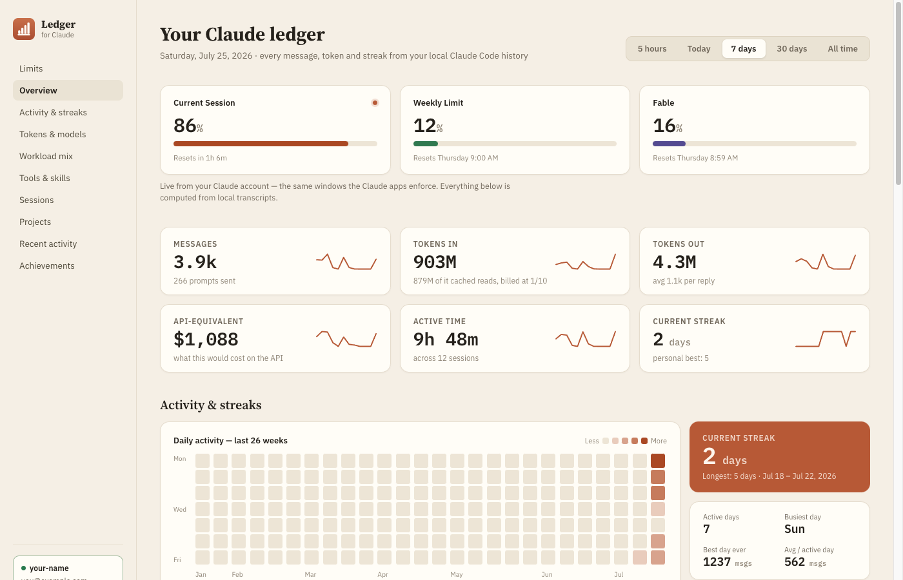
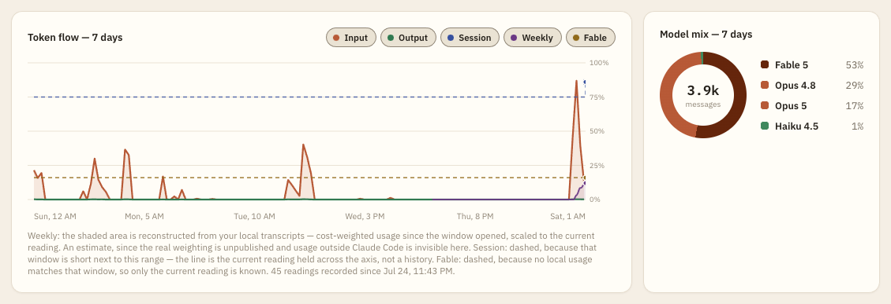
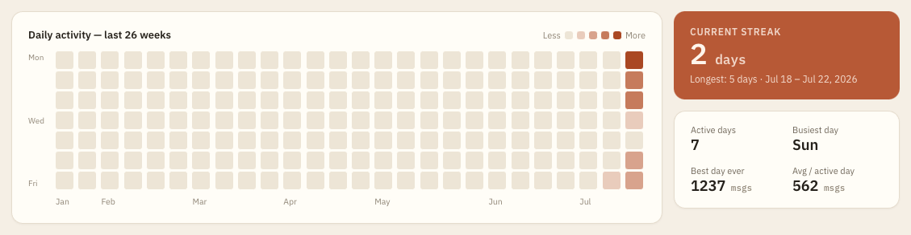
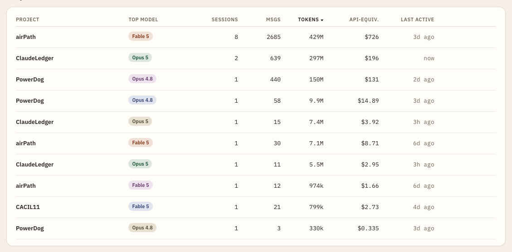
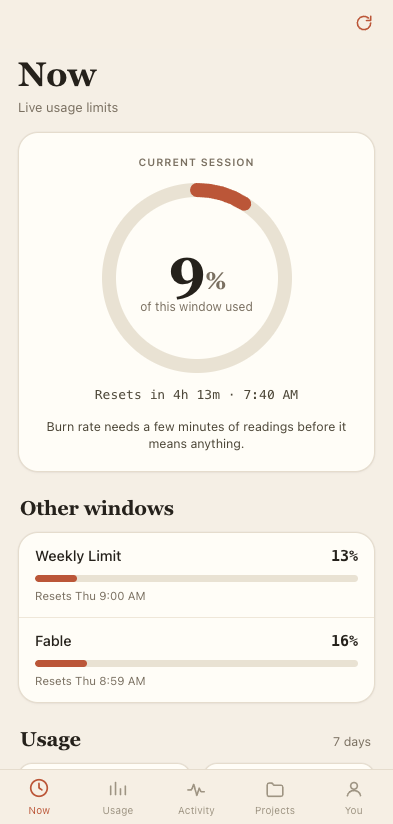
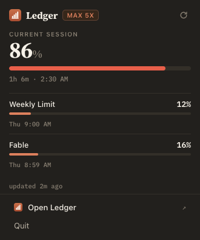

<p align="center">
  
</p>

<h1 align="center">Claude Ledger</h1>

<p align="center">
  <strong>Every message, token, model and streak from your local Claude Code history.</strong>
</p>

<p align="center">
  A macOS and Windows dashboard, a menu bar item, and an iPhone app for your Claude Code usage.<br>
  Signs in with <strong>your Claude account</strong> — no API key, no token pasting, no password prompt.
</p>

<p align="center">
  <a href="https://github.com/Amar-Goyal8/ClaudeLedger/releases/latest"></a>
  <a href="https://github.com/Amar-Goyal8/ClaudeLedger/stargazers"></a>
  <a href="https://github.com/Amar-Goyal8/ClaudeLedger/releases/latest"></a>
  
  
  
  
</p>

<p align="center">
  <a href="#what-you-get">What you get</a> ·
  <a href="#install">Install</a> ·
  <a href="#on-your-phone">Phone</a> ·
  <a href="#the-chart">The chart</a> ·
  <a href="#menu-bar-item">Menu bar</a> ·
  <a href="#how-the-account-connection-works">Account</a> ·
  <a href="#where-the-numbers-come-from">Data</a> ·
  <a href="#develop">Develop</a> ·
  <a href="#known-limitations">Limits</a>
</p>

<p align="center">
  
</p>

---

Claude Code writes a JSONL transcript of every session to `~/.claude/projects/`. That's a
complete record of your work — and nothing reads it. Claude Ledger does: it scans those
files, prices them at Anthropic's published rates, and puts your live account limit windows
on top.

Two data sources, cleanly split:

```
┌─ local, always available ─────────────────────────────────────────┐
│  ~/.claude/projects/**/*.jsonl                                    │
│      ↓  scan · de-duplicate by uuid · price per message           │
│  messages · tokens · models · cost · streaks · tools · projects   │
└───────────────────────────────────────────────────────────────────┘
┌─ your account, live ──────────────────────────────────────────────┐
│  Claude Code's own OAuth credential (read-only, never copied)     │
│      ↓  GET /api/oauth/profile · GET /api/oauth/usage             │
│  session + weekly + model-scoped limit windows, reset times       │
└───────────────────────────────────────────────────────────────────┘
```

Network down? Every panel except *Usage limits* still renders.

## What you get

| | Panel | What it answers |
|---|---|---|
| 🔴 | **Usage limits** | Live session / weekly / model-scoped windows with real reset times |
| 📊 | **Overview** | Messages, tokens in and out, API-equivalent cost, active time, streak — each with a sparkline |
| 🔥 | **Activity & streaks** | 26-week heatmap, current and longest streak, busiest weekday, best day ever |
| 📈 | **Token flow** | Input/output over time on one axis with limit utilization — zoomable, see [The chart](#the-chart) |
| 🍩 | **Model mix** | Share by model, with per-model tokens, average reply length and cost |
| ⚙️ | **Workload mix** | Main thread vs. subagents, tool calls, cache hit rate, thinking share |
| 🔧 | **Tools & skills** | Which tools you actually call, ranked |
| 🕐 | **Sessions** | Count, average and longest length, peak hour, hour-of-day histogram |
| 📁 | **Projects** | Per-project sessions, messages, tokens, cost, top model, last active — sortable |
| 📜 | **Recent activity** | The last things you did, with surface tags |
| 🏆 | **Achievements** | Lifetime badges, earned and locked |

<details>
<summary><strong>More screenshots</strong></summary>

<br>

**Token flow and model mix** — dual-axis chart with limit lines, and the model donut.



**Activity and streaks** — 26 weeks of daily activity; hover any day for its real figures.



**Projects** — sortable, one row per project per model.



</details>

## Install

**macOS** — download `ClaudeLedger-1.1.0-arm64.dmg` from
[Releases](../../releases/latest), open it, drag **Claude Ledger** to Applications.

**Windows** — download `ClaudeLedger-1.1.0-setup.exe` from the same place and run it. It
carries both x64 and ARM64, installs for your user only, and needs no admin prompt. See
[First launch on Windows](#first-launch-on-windows) below — SmartScreen blocks it once.

Or build it yourself:

```sh
git clone <this repo> && cd ClaudeLedger
npm install          # approve electron's postinstall if npm asks
npm run dist         # macOS   -> dist/ClaudeLedger-1.1.0-arm64.dmg
npm run dist:win     # Windows -> dist/ClaudeLedger-1.1.0-setup.exe
```

Both targets build from either host: electron-builder fetches the Windows toolchain itself,
so a Mac produces the installer without a Windows machine in the loop.

> [!IMPORTANT]
> **First launch on macOS needs one extra step.** The app is ad-hoc signed but not notarized — there
> is no Apple Developer ID on the build machine — so Gatekeeper blocks a plain double-click.
>
> 1. Double-click **Claude Ledger**. macOS refuses and says it can't verify the developer.
> 2. Click **Done**.
> 3. Open **System Settings → Privacy & Security**, scroll to the **Security** section,
>    and click **Open Anyway** next to *"Claude Ledger was blocked…"*.
> 4. Confirm with **Open Anyway**, then Touch ID or your password.
>
> Once approved it launches normally forever after. Right-click → **Open** → **Open** also
> works on older macOS, but on recent versions the Settings route is the one that reliably
> offers the bypass.

<h3 id="first-launch-on-windows">First launch on Windows</h3>

The installer is not code-signed — there is no EV certificate on the build machine — so
SmartScreen blocks the first run of a copy it hasn't seen before:

1. Run `ClaudeLedger-1.1.0-setup.exe`. Windows says *"Windows protected your PC"*.
2. Click **More info** — the **Run anyway** button is hidden behind that link, which is
   where people get stuck.
3. Click **Run anyway**.

If your organization enforces SmartScreen or WDAC the installer may be blocked outright with
no bypass. That's policy rather than something the app can work around; build it yourself
with `npm run dist:win`, or ask whoever administers the machine.

> [!TIP]
> No Claude Code login yet? Run `claude` in a terminal and sign in with your Claude
> subscription, then press **Connect**. The app reads that existing login — it never asks you
> for a secret.

<details>
<summary><strong>If macOS says "damaged and can't be opened"</strong></summary>

<br>

That wording means the bundle's signature failed validation, not that the download is
corrupt — and unlike the "can't verify the developer" dialog, **there is no Open Anyway
button for it.** Clear the quarantine flag by hand:

```sh
xattr -dr com.apple.quarantine "/Applications/Claude Ledger.app"
```

> [!WARNING]
> Only run that on a build you produced or trust — it strips the flag that makes Gatekeeper
> check the bundle at all.

Builds from this repo shouldn't hit it: `scripts/adhoc-sign.cjs` ad-hoc signs the bundle as
an `afterPack` hook and fails the build if `codesign --verify --deep --strict` doesn't pass.
Before that hook existed, `mac.identity: null` left the app with nothing but Electron's own
linker-signed binary — `Sealed Resources=none`, `Info.plist=not bound` — which ran fine from
`dist/` on the build machine and reported as damaged the moment anyone downloaded it.

If you do have a Developer ID certificate, set `mac.identity` in `package.json` to its name
and add `notarize`; then none of this applies and the app opens on a plain double-click.

</details>

<details>
<summary><strong>Keychain access prompt</strong></summary>

<br>

The app shells out to `/usr/bin/security` to read the credential. Because the keychain ACL
applies to `security` — a tool you have already trusted — rather than to this app, you
generally will **not** see an extra prompt. If macOS does ask *"Claude Ledger wants to use
your confidential information"*, choose **Always Allow**.

</details>

## On your phone

The same ledger, rebuilt for a thumb: five tabs, a session ring you can read across a room,
pull to refresh, haptics, and a dark theme that follows the system.

<p align="center">
  
</p>

| Tab | What's on it |
|---|---|
| **Now** | Session ring with live countdown and burn rate, every other limit window, headline figures, latest sessions |
| **Usage** | Range switch, six stat tiles, a token-flow chart you scrub with a finger, model mix and per-model detail |
| **Activity** | Streak, 18-week heatmap, hour-of-day histogram, tool and skill ranking |
| **Projects** | Filterable project list, tap through to detail, recent activity feed |
| **You** | Plan and account, achievements, which Mac you're paired with, unpair |

### How the phone gets the data

There is no Node on a phone, no `~/.claude/projects/`, and no keychain. So the phone computes
nothing: it pairs with your Mac over your own Wi-Fi and renders the same JSON snapshot the
desktop window renders.

```
  iPhone                                     your Mac
 ┌────────────────────┐                    ┌──────────────────────────────────┐
 │ Claude Ledger      │  Bearer <token>    │ 0.0.0.0:4317   (off by default)  │
 │  · shaped figures  │ ─────────────────▶ │      ↓                           │
 │  · last snapshot   │ ◀───────────────── │ transcripts + OAuth credential   │
 │    cached offline  │   snapshot JSON    │      ↑ never leaves this machine  │
 └────────────────────┘                    └──────────────────────────────────┘
```

**Your Claude token never leaves the Mac.** The phone only ever receives figures.

Sharing is off until you turn it on, stops when you quit the app, and is reachable only with
a bearer token issued during pairing. The pairing code is six digits, expires in five minutes,
and dies after five wrong guesses.

### Pair a phone

1. On the Mac: **Claude Ledger → Pair a Phone…** (`⌘P`), or right-click the menu bar icon.
2. Turn on **Share over Wi-Fi**. The window shows your Mac's address and a six-digit code.
3. On the phone, either scan the QR with the built-in Camera app, or type the address and
   code into the app's pairing screen.

Both devices need to be on the same Wi-Fi. Two permission prompts appear once, and both have
to be allowed or the phone can't reach the Mac:

- **macOS** asks whether to let Claude Ledger accept incoming network connections, the first
  time you turn sharing on.
- **iOS** asks for permission to find devices on your local network, the first time the phone
  connects.

### Install it on your iPhone

There are two routes, and the first needs nothing but Safari.

**Just open it in Safari.** With sharing on, the pairing window prints a URL like
`http://192.168.1.42:4317/?code=417392`. Open that on your phone and you have the whole app,
already paired. Add to Home Screen and it runs full-screen with its own icon.

**Or build the real app in Xcode.** No paid Apple Developer account required — a free Apple ID
signs an app onto your own device for seven days, then you rebuild.

```sh
npm install
npm run ios:add      # scaffolds ios/, then configures Info.plist and the icon
npm run ios:open     # opens the Xcode workspace
```

In Xcode: select the **App** target → **Signing & Capabilities** → tick *Automatically manage
signing* and pick your Apple ID team. Plug the phone in, change the run destination from your
Mac to your phone, and press ▶. On first launch the phone will ask you to trust the developer
under **Settings → General → VPN & Device Management**.

After changing anything under `mobile/`, run `npm run ios:sync` to copy it into the project.

> [!NOTE]
> `ios/` is generated and git-ignored. Everything specific to this app —
> the local-network permission string, the ATS exception, the `claudeledger://` URL scheme,
> the app icon and the launch image — is reapplied by `scripts/ios-configure.mjs`, which runs
> automatically as part of `ios:add` and `ios:sync`. Nothing has to be re-edited by hand after
> a clean checkout.

### Away from the Mac

The phone keeps the last snapshot and shows it with an explicit *"Showing cached figures from
2:14 PM"* banner rather than pretending the numbers are live. Live limits need the Mac awake
and on the same network — copying the OAuth token onto the phone would fix that, and this app
deliberately does not copy that credential anywhere.

## The chart

Token flow is the one panel you drive. Tokens use the left scale, limit utilization a fixed
0–100% right scale, and both share a real-time x-axis.

| Gesture | Does |
|---|---|
| **Scroll** over the chart | Zoom the time axis, anchored on the cursor |
| **Shift-scroll** / horizontal scroll | Pan |
| **Double-click**, or **Reset zoom** | Back to the whole range |
| **Hover** | Every visible series at that bucket, with a marker on each line |
| **Click a chip** | Toggle a series; any combination works |

At full zoom-out a further scroll-out falls through to the page, so the chart never traps the
scroll of the page it sits in. Zooming rescales the token axis to what's on screen, so detail
isn't flattened against a peak that's no longer in view.

### Why some limit lines are dashed

The usage endpoint reports a **level**, never a series, so a limit line has to be built
rather than read:

- **Solid, with a shaded area** — reconstructed from your local transcripts: cumulative
  cost-weighted usage since the window opened, rescaled so its endpoint equals the measured
  reading. An estimate, since the real weighting is unpublished and usage outside Claude Code
  is invisible here.
- **Dashed, flat** — the current reading carried across the axis, because there is no
  trajectory to draw. Either the window is short next to the range (a 5-hour session window
  on a 7-day axis is a three-pixel vertical wall) or no local usage matches it at all.

Each line ends in a single marker: that point, and only that point, is what the API actually
reported. The footnote under the chart always names which line is which and why. Nothing is
drawn as if it were measured when it wasn't.

## Menu bar item



The app lives in the menu bar as well as the dock — on Windows, in the notification area.
The icon shows your **session window** percentage — the limit that actually interrupts work —
and clicking it opens a popover with every limit the API reports, each with its own reset
time. On Windows that percentage is in the icon's tooltip instead, since there's no title
text beside a notification area icon, and the popover opens above the icon rather than
below it.

- **Left click** — popover. **Right click** — a short menu (Open Dashboard / Refresh / Quit).
- The popover shows a **sparkline of your recorded session readings** and, when there's
  enough history to be honest about it, a burn-rate warning
  (`at 37.2%/hr you'll hit the session limit in 48m`).
- The API reports a *level*, not a rate, so the rate is derived from stored readings: it
  appears only once there are two samples at least three minutes apart **in the same
  window**, and never extrapolates from a single reading.
- Polls every 5 minutes — see [rate limiting](#rate-limiting-and-why-the-cache-is-on-disk)
  for why not faster.

<br clear="right">

<details>
<summary><strong>Which limits appear, and why that took care</strong></summary>

<br>

The usage payload describes limits two ways, and only one of them is complete:

- a **`limits` array** of `{kind, group, percent, severity, resets_at, scope}` entries — this
  is where model-scoped caps live (`kind: "weekly_scoped"` with
  `scope.model.display_name: "Fable"`), and
- **legacy flat keys** (`five_hour`, `seven_day`, `seven_day_opus`, `seven_day_sonnet`, …).

On current plans the scoped *legacy* keys are all `null`, so reading only those makes it look
like no per-model limit exists when the array is reporting one. The app prefers the array and
falls back to the flat keys for older responses.

Windows render from whatever the endpoint actually returns, so a new limit type shows up
without a code change; a window that's present but empty renders as **"not reported"** rather
than a fabricated zero.

</details>

## How the account connection works

There is no public OAuth app you can register to read a personal Claude account, and no API
that exposes claude.ai chat history. So this app does the one honest thing available: **it
reads the OAuth credential Claude Code already stored when you logged in.**

| Platform | Where the credential lives |
|---|---|
| **macOS** | login keychain, generic password, service `Claude Code-credentials` |
| **Linux / Windows** | `~/.claude/.credentials.json` |

That credential is a Claude subscription OAuth token (`subscriptionType: "max"` for a Max
plan). Two Anthropic endpoints accept it, and they are the only network calls this app makes:

| Endpoint | Used for |
|---|---|
| `GET /api/oauth/profile` | your name, email, plan (`has_claude_max`), org, rate-limit tier |
| `GET /api/oauth/usage` | live session and weekly utilization, reset times, extra-usage credits |

Both are sent as `Authorization: Bearer <token>` plus `anthropic-beta: oauth-2025-04-20`.

> [!NOTE]
> **Why read an existing login instead of running an OAuth flow?** Doing our own flow would
> mean impersonating Claude Code's OAuth client ID. Reading the credential it already wrote
> avoids that entirely, never asks you for a secret, and never stores a second copy of your
> token. Claude Code refreshes that credential in place and this app re-reads it on every
> request, so it stays current on its own.

If the token has expired, run any `claude` command in a terminal (that refreshes it) and press
**Connect**.

### What it never does

| | |
|---|---|
| ❌ | Writes to the keychain or the credentials file — **read-only** |
| ❌ | Sends the token anywhere except `api.anthropic.com` |
| ❌ | Logs the token, caches it to disk, or returns it over its own HTTP API — `/api/connection` reports status and scopes only |
| ❌ | Listens on anything but `127.0.0.1`, on an OS-assigned port, so it is unreachable from your network |
| ❌ | Phones home. No telemetry, no analytics, no accounts, no backend |

### Rate limiting, and why the cache is on disk

`/api/oauth/usage` rate-limits, and it is easy to trip: the menu bar and the dashboard both
want the same data. Three things keep the app well-behaved, each of which exists because its
absence caused a real failure.

<details>
<summary><strong>The three, and the bugs behind them</strong></summary>

<br>

1. **A 5-minute TTL and matching poll intervals** (menu bar 5 min, dashboard 2 min). Polling
   both surfaces every 60 s against a 45 s cache was enough to earn a `429`.
2. **Stale-but-valid over empty.** A failed refresh returns the last good value flagged
   `stale`, so a transient `429` labels the panel "cached 6m ago" instead of blanking it.
   Invalidation therefore *expires* entries rather than deleting them — deleting would throw
   away the fallback and reintroduce the blank panel.
3. **Per-endpoint backoff, persisted to disk** at `~/.claude-ledger/account-cache.json`
   (mode `0600`). Two bugs lived here. The backoff was originally global, so a concurrent
   `profile` success reset the backoff a rate-limited `usage` had just set — the app then
   retried every poll and held the limit open indefinitely. And the cache was memory-only, so
   every restart refetched from scratch with no fallback.

The cache holds account metadata and utilization numbers. **The OAuth token is never written
to it** — that stays in the keychain.

</details>

## Where the numbers come from

**Local transcripts** — `~/.claude/projects/**/*.jsonl`. Every panel except *Usage limits* is
computed from these. A full scan of ~40 MB takes ~150 ms; results are cached per file and
invalidated on mtime and size.

> [!NOTE]
> **De-duplication matters and is easy to get wrong.** Resuming or forking a session copies
> the parent transcript, so the same assistant message physically exists in several files.
> Records are keyed by `uuid`, which is stable across those copies — that is what keeps token
> totals from double-counting.

**Your account** — only the *Usage limits* section, live from the two endpoints above.

### "API-equivalent" cost

A Max subscription is flat-rate, so **you are not billed any of the dollar figures shown**.
They answer a different question: *what would this usage have cost on the API?* — the only
meaningful way to price token spend, and incidentally what shows the subscription's worth.

Rates are Anthropic's published per-MTok list prices, with cache multipliers applied per
message (read `0.1×` input, 5-minute write `1.25×`, 1-hour write `2×`):

| Model | Input | Output |
|---|---:|---:|
| Fable 5 / Mythos 5 | $10 | $50 |
| Opus 4.8 / 4.7 / 4.6 / 4.5 | $5 | $25 |
| Sonnet 5 / 4.6 / 4.5 | $3 | $15 |
| Haiku 4.5 | $1 | $5 |

Models with no published list price (e.g. `claude-opus-5`) are costed at their tier rate and
marked `*` in the model table, with a footnote. An unrecognized model falls back to
longest-prefix matching rather than silently costing zero.

> [!TIP]
> **Tokens in** is dominated by cache reads — every turn re-reads the whole cached prefix — so
> the figure is large by design. The card's subtitle breaks out how much of it was cached and
> reminds you it bills at 1/10.

### What is deliberately missing

The original design had a **Products** row (Chat / Code / Design / API / Mobile). That cannot
be populated: local transcripts only ever describe Claude Code — every record on this machine
has `entrypoint: "cli"` — and no account API exposes claude.ai chat, Design, or mobile
history. Rather than invent five plausible-looking numbers, that section was replaced with
**Workload mix**, built from dimensions the transcripts genuinely carry.

## Develop

```sh
npm install          # approve electron's postinstall if npm asks
npm start            # run the Electron app
npm run serve        # or: plain browser mode at http://127.0.0.1:4317
npm test             # QR encoder self-test
```

`npm run serve` is the same server the app embeds, so you can iterate on the frontend in a
normal browser with devtools. There is no build step — dashboard and phone UI are both vanilla
JS, HTML and CSS.

The phone UI is served alongside it at **`http://127.0.0.1:4317/m/`**, which is the fastest way
to work on it: open that in a browser, switch to a phone viewport in devtools, and it detects
the loopback server and skips pairing entirely.

```sh
npm run dist              # regenerates the icons, then builds dist/*.dmg
npm run dist:unpacked     # .app only, no DMG — faster for testing packaging
npm run dist:win          # x64 + ARM64 NSIS installers
npm run dist:win:unpacked # unpacked Windows tree only
```

The Windows targets build from a Mac: electron-builder downloads the Windows Electron binary,
wine and NSIS on first use, and `scripts/make-icon.mjs` writes `build/icon.ico` itself rather
than shelling out, so no image tooling is needed either. `npm run dist:win` emits three files —
a combined installer plus one per architecture.

<details>
<summary><strong>Two macOS build details worth knowing, both load-bearing</strong></summary>

<br>

- **App Sandbox must stay off.** A sandboxed app cannot read another application's keychain
  item at all, which would break the entire connect flow. `hardenedRuntime` is likewise off
  because there is no Developer ID to sign against.
- **`dmg.backgroundColor` must be lowercase hex.** The vendored `dmgbuild` color parser is
  `#([0-9a-f]{3}(?:[0-9a-f]{3})?)$` with no `IGNORECASE`, so `#F6F1E8` fails and `#f6f1e8`
  works. Worse, `dmg-builder` tries `python3`, swallows its error, then falls back to `python`
  — which does not exist on modern macOS — so the real failure surfaces as the misleading
  `Command failed: which python`. To see the true error, re-run with
  `PYTHON_PATH=/usr/bin/python3`.

</details>

### Layout

```
server.js                        HTTP server + JSON API (also the Electron backend)
electron/main.cjs                app shell: loopback server, window, tray, popover, pairing
electron/preload.cjs             the popover's only bridge to the main process
electron/preload-pair.cjs        the pairing window's bridge
src/credentials.js               reads the Claude Code OAuth credential (read-only)
src/anthropic.js                 profile + usage, caching, backoff, burn-rate samples
src/transcripts.js               JSONL scan, parse, de-duplicate
src/aggregate.js                 all metrics: ranges, streaks, heatmap, models, cost
src/pricing.js                   per-model list prices and cache multipliers
src/lan.js                       phone pairing: codes, device tokens, interfaces
src/mark.js                      the logo, rendered to PNG with no image deps
public/index.html|.css|app.js    dashboard (vanilla, no build step)
public/panel.html|.css|panel.js  menu bar popover
public/pair.html|.css|pair.js    pairing window
public/qr.js                     QR encoder, ~200 lines, no dependency
mobile/index.html|styles|app.js  the phone UI — also what Capacitor bundles into the iOS app
capacitor.config.json            iOS wrapper config (webDir: mobile)
scripts/make-icon.mjs            builds icon.png/icns from src/mark.js
scripts/ios-configure.mjs        reapplies Info.plist keys and iOS assets after cap sync
scripts/qr-selftest.mjs          validates the QR encoder against the published tables
```

The popover and pairing renderers are sandboxed with no Node and no network of their own — they
reach the main process only through the handful of calls in their preloads.

Two listeners, deliberately different. The desktop window talks to a loopback-only server with
no auth, because nothing off the machine can reach it. Phones talk to a second server bound to
every interface, which requires a bearer token on every route except `/api/ping` and
`/api/pair`, serves the phone UI at its root, and never serves the desktop dashboard.

Set `LEDGER_SHOW_PANEL=1` to have the popover open on launch, or `LEDGER_SHOW_PAIR=1` for the
pairing window — both are otherwise awkward to drive from a script.

> [!WARNING]
> The logo geometry lives in **both** `public/logo.svg` and `src/mark.js`, in the same 0–100
> coordinate space. Change one, change the other, or the app icon and the in-app mark drift.
> `src/mark.js` renders two variants: the full mark for the app icon, and a compact three-bar
> version for the menu bar (four bars with 4-unit gaps collapse to under a pixel each at
> 16px).

### API

| Route | Returns |
|---|---|
| `GET /api/snapshot?range=5h\|today\|7d\|30d\|all&weeks=8..52` | the whole dashboard payload |
| `GET /api/account` | profile + live limits |
| `GET /api/connection` | credential status, source, scopes — never the token |
| `GET /api/history?since=<ms>` | recorded limit readings |
| `GET /api/usage-curve?from&to&points&model` | reconstructed cumulative usage for a window |
| `GET /api/pulse` | cheap transcript fingerprint, for change detection |
| `POST /api/reconnect` | drops caches and re-reads the credential |
| `GET /api/ping` | "is a Claude Ledger here?" — says nothing about the account |
| `POST /api/pair` | `{code, name}` → a device token. Shared listener only |
| `GET /api/devices` | paired phones — never their tokens |

On the shared listener every route above needs `Authorization: Bearer <device token>` except
`/api/ping` and `/api/pair`.

## Known limitations

- **The macOS build is Apple silicon only** as configured (`arch: ["arm64"]`). Add `"x64"` to
  the DMG target for Intel.
- **Neither build is signed with a purchased certificate.** macOS is ad-hoc signed and not
  notarized; the Windows installer isn't signed at all, so SmartScreen warns on first run.
- **On Windows the session figure lives in the tooltip**, not beside the icon: the notification
  area has no equivalent of the macOS menu bar's title text.
- **Heatmap, streaks and achievements are always all-time**, independent of the range switch —
  they are lifetime facts and the design presents them that way.
- **Active time is gap-based**: consecutive messages more than 5 minutes apart don't
  accumulate, so an overnight pause isn't counted as eight hours of work. It measures hands-on
  time, not wall-clock span.
- **Limit history starts when you first run the app.** The API reports a level, not a series,
  so it cannot be backfilled — see
  [why some limit lines are dashed](#why-some-limit-lines-are-dashed).
- The desktop dashboard loads fonts from Google Fonts; offline, it falls back to system serif /
  sans / mono. The phone UI uses the system faces only, so it never blocks on the network.
- **The phone needs the Mac awake and on the same Wi-Fi** for live figures. Off-network it shows
  the last snapshot, labelled with when it was taken.
- **A free Apple ID signs the iOS app for seven days**, then it must be rebuilt from Xcode.
  That's an Apple limit, not one of this app's — the Safari route has no expiry.
